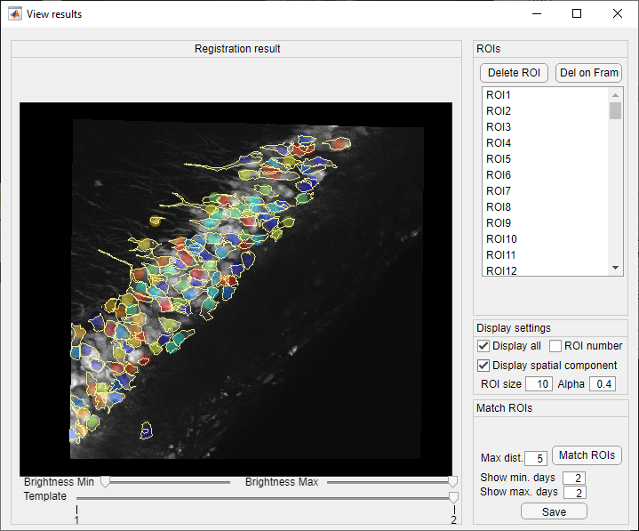

# manual-multisession-alignment
A simple tool for manually track neurons across days.
This tool is developed for aligning suite2p results (exported to MatLab) across sessions/days.

This is a MATLAB GUI for manually tracking the same neurons across multiple session/days. Test run on Matlab2018b works fine. Still under more testing/development. The GUI displays a set of image templates, and allows you to interactively add new ROIs, and edit their locations individually on each of the templates.

## Functions:
### Loading template and manually curating registration landmarks
Template panel:

See `save_multisession_template_example` for an example of how to generate template files from suite2p results.
- Load template: choose a .mat file that contains image templates. Templates have to be stored in a cell array named 'template'; each cell has the template (2d matrix) from a separate day/session.
  Templates can be viewed by scrolling the middle wheel of the mouse.
- Load spatial component: choose a .mat file that contains pre-defined spatial components for each day. Spatial components have to be stored in a cell array (1 x template number) named 'ROI_mask'. Each cell has two fields: ROI_mask{n}.cont is a number_of_neuron x 1 cell array, containing contour points for each active cell region; ROI_mask{n}.cent is a number_of_neuron x 2 matrix, containing centroids of neurons. This is not required for manually tracking neurons, but it's required for ROI-based registration.
- Add on Frame (keyboard shortcut: a): when clicked/pressed a, you can click anywhere on the current template and create/edit the location of current ROI (new ROIs must be added first from the right panel).
- Delete on Frame (keyboard shortcut: d): when clicked/pressed d, you can delete the location of the current ROI on this frame.

ROI panel:
- Add ROI: add new ROI to the listbox
- Delete ROI: delete current ROI
- Load: load a ROI file; must contain a variable named 'roi_coord'; it should be a number of ROI x number of template x 2 matrix, containing coordinates of each ROI on each template. Missing ROIs are stored as NaNs.
- Save: save current results. The result will be saved in variable 'roi_coord', as described above.

Display settings panel:
- Display all: display all ROIs
- ROI number: display ROI number (as shown in the ROIs list above)
- Display spatial component: view spatial components
- ROI size: ROI display size
- Alpha: ROI display transparency

### Register templates from ROIs
if you have annotated the same neurons (at least 4) across templates, you can perform an ROI-based template registration here. Template will be matched to a chosen one using manually tracked ROIs as landmarks. Spatial components (need to be loaded) will also be transformed. The result will be shown in a new window, and ROIs that are spatially close enough across templates will be assigned to the same neuron (stored in a variable 'roi_list' with shape number_unique_neuron x number_template). Neurons that can't be found is stored as NaN. The next figure also provide tools to visualize assigned neurons.
Note that the manually annotated neurons don't have to be found in all templates. Templates are matched to the adjacent ones, therefore only the neurons that are tracked in two adjacent templates will be used for registering these two templates. All templates and spatial components are transformed to the chosen template number in the end.

Settings:
- horizontal: number of imaging planes in horizontal axis in the template (suitable for multiplane imaging)
- vertical: number of imaging planes in vertical axis in the template (suitable for multiplane imaging)
- Template: Template number for registration

## ROI matching
Once you run the registration, a new window will be displayed. In this window, you can view the registered templates, as well as match ROIs according to a spatial distance threshold.

Match ROIs panel:
- Max dist.: maximum distance between preloaded spatial component centroid across days to be considered the same ROI. The smaller the number, the more strict the matching criteria.
- Show min. days: display ROIs that are tracked for at least this number of days/sessions
- Show max. days: display ROIs that are tracked for at most this number of days/sessions
- Save: save mat result. This will save a variable "roi_list" with the size number_unique_rois-by-number_days. Each row of this matrix contains the index of this tracked ROI across days. Non-matched days are filled with NaNs. 

ROI panel:
- Delete ROI: delete matched ROIs (for all days) from the listbox
- Del on frame: delete the current ROI from the matched results on the current frame

## Interface
### Interface for loading template and manually selecting landmarks:

### Interface for displaying and modifying registered template, and matched ROIs:

